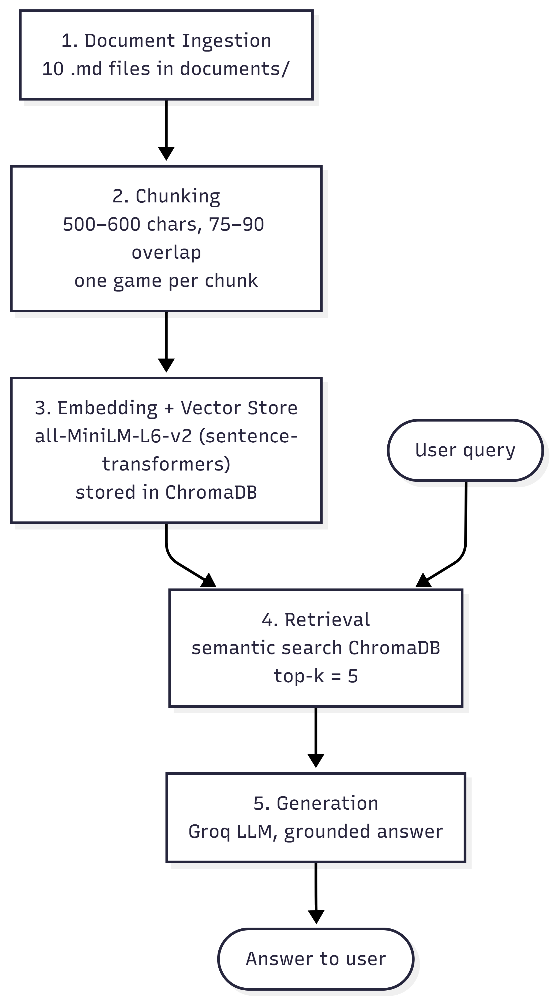

# Project 1 Planning: The Unofficial Guide

> Write this document before you write any pipeline code.
> Your spec and architecture diagram are what you'll use to direct AI tools (Claude, Copilot, etc.) to generate your implementation — the more specific they are, the more useful the generated code will be.
> Update the Retrieval Approach and Chunking Strategy sections if you change your approach during implementation.
> Update this file before starting any stretch features.

---

## Domain

**PS5 Game Discovery Guide**

The PS5 Game Discovery Guide is a knowledge base that helps players decide what to play on the
PlayStation 5 based on genre, gameplay style, and community and critic recommendations. It draws
on editorial "best PS5 games" rankings, the official PlayStation catalog, and player discussion
threads to answer questions such as "What's the best PS5 exclusive?", "What is a good PS5 RPG for
a newcomer?", or "What co-op games are recommended on PS5?"

This knowledge is hard to find in one place because PS5 recommendations are scattered across
review sites, official store listings, and community forums — each using different criteria and
formats. By combining these sources into a single searchable system, a player can compare critic
and community opinions and get a recommendation without visiting half a dozen sites.

> **Scope note:** Originally framed as an all-platform, all-genre guide. Narrowed to PS5 only to
> keep the corpus focused and content-rich (less duplicate/overlapping content, more gradable
> questions). The cross-platform source list is preserved in git history if scope is expanded later.

---

## Documents

<!-- List your specific sources: URLs, subreddit names, forum threads, or file descriptions.
     Aim for at least 10 sources that together cover different subtopics or perspectives within your domain. -->

Scope: **PS5 only.** Sources mix editorial rankings, the official catalog, and community
discussion so the corpus has critic opinions, official descriptions, and player perspectives.
Prefer prose-rich pages (paragraph reviews/reasoning) over bare title lists for better retrieval.

The final corpus is **10 sources**, each with a collected document in `documents/`. Five are broad
"best PS5 games" rankings (official catalog, critic aggregates, editorial top lists); five are
genre-specific lists (RPG, horror, indie, open-world, co-op/multiplayer) that add depth for
genre-based queries.

| # | Source | Type | Document |
|---|--------|------|----------|
| 1 | PlayStation Official PS5 Catalog | Official catalog | `documents/playstation_ps5_catalog.md` |
| 2 | Metacritic Best PS5 Games | Critic-score aggregate | `documents/metacritic_best_ps5_games.md` |
| 3 | OpenCritic Best PS5 Games | Critic-score aggregate | `documents/opencritic_best_ps5_games.md` |
| 4 | IGN Best PS5 Games (Top 25) | Editorial ranking | `documents/ign_best_ps5_games.md` |
| 5 | Polygon 25 Best PS5 Games | Editorial ranking | `documents/polygon_best_ps5_games.md` |
| 6 | Eneba 13 Best PS5 RPGs | Genre ranking — RPG | `documents/eneba_best_ps5_rpgs.md` |
| 7 | Eneba 13 Best PS5 Horror Games | Genre ranking — Horror | `documents/eneba_best_ps5_horror_games.md` |
| 8 | Digital Trends Best PS5 Indie Games | Genre ranking — Indie | `documents/digitaltrends_best_ps5_indie_games.md` |
| 9 | TrueTrophies Best PS5 Open-World Games (Top 25) | Genre ranking — Open-World | `documents/truetrophies_best_ps5_open_world_games.md` |
| 10 | Push Square Best PS5 Online Multiplayer Games (Top 40) | Genre ranking — Co-op/Multiplayer | `documents/pushsquare_best_ps5_online_multiplayer_games.md` |

Source URLs are recorded in the header of each document file.

<!-- Scope narrowed from an all-platform list to PS5; uncollected/blocked sources (GameSpot,
     GamesRadar, TechRadar, PS Lifestyle, Reddit, GameFAQs) and the original cross-platform list
     were dropped so the source list matches the 10 collected documents. All recoverable in git
     history if scope is expanded. -->

---

## Chunking Strategy

<!-- How will you split documents into chunks?
     State your chunk size (in tokens or characters), overlap size, and explain why those
     numbers fit the structure of your documents.
     A review-heavy corpus warrants different chunking than a long FAQ. -->

**Chunk size:** 500-600 Characters

**Overlap:** 75-90 characters - protects an entry that straddles a boundary so the game isn`t orphaned.

**Reasoning:**
I chose this strategy based on the documents I collected and a pattern I noticed: games are listed one per entry, each with a heading (name + genre + score) followed by a short description. Most entries are short — roughly 250–450 characters across the name/score/genre and description. A chunk size of 500–600 characters is ideal because it keeps a whole game entry — heading and description — together in one chunk, so a single chunk can answer score-, genre-, or description-based queries. Anything smaller (around 250) would split the description from the game name, leaving half a fact. Anything much larger (1000+) would merge multiple unrelated games into one chunk and blur the embedding, hurting retrieval precision. The 75–90 character overlap protects any entry that happens to straddle a chunk boundary.

---

## Retrieval Approach

<!-- Which embedding model are you using (e.g., all-MiniLM-L6-v2 via sentence-transformers)?
     How many chunks will you retrieve per query (top-k)?
     If you were deploying this for real users and cost wasn't a constraint, what tradeoffs
     would you weigh in choosing a different embedding model — context length, multilingual
     support, accuracy on domain-specific text, latency? -->

**Embedding model:** all-MiniLM-L6-v2 (via sentence-transformers). The entries in my data are short, so they don't need a large or complex model to embed well. MiniLM is lightweight, runs locally and free, and is more than capable of handling short game blurbs — it gets the job done without unnecessary overhead.

**Top-k:** 5, based on the data I collected. Since each chunk is a single game entry, top-k = 5 hands the model about five candidate games — enough to answer a recommendation question well. Going much higher would dump too many chunks on the model and bury the relevant games in noise, so keeping it precise at ~5 is the right balance.

**Production tradeoff reflection:**
If cost weren't a constraint, I could reach for a larger, more accurate embedding model (or a hosted API model) that captures more nuance. But for this project MiniLM is still the right call: my data is short, straightforward, and structured around scores and a ranking system, so a heavier model wouldn't meaningfully improve retrieval. I'd only consider upgrading if my documents were longer or more nuanced, where I'd then weigh accuracy against added latency and cost. It's also worth noting that adding more documents would mainly scale my vector store and embedding step, not the LLM — Groq only ever sees the top-k retrieved chunks, so a bigger LLM would only matter if I raised top-k significantly.

---

## Evaluation Plan

<!-- List your 5 test questions with their expected correct answers.
     Questions should be specific enough that you can judge whether the system's response
     is right or wrong. "What are good dining halls?" is too vague.
     "What do students say about wait times at [dining hall name] during lunch?" is testable. -->

Each question targets specific content in the corpus so a response can be judged right or wrong.
Expected answers below are based on collected sources and will be finalized once all documents
are ingested (Milestone 3).

| # | Question | Expected answer |
|---|----------|-----------------|
| 1 | What is a good co-op shooter to play on PS5? | **Helldivers 2** — a co-op shooter for up to four players fighting an alien scourge threatening Earth. (PlayStation catalog) |
| 2 | What's a recommended story-driven action game on PS5? | **God of War Ragnarök** (Kratos and Atreus journey through the Nine Realms) or **Stellar Blade** (story-driven action in a post-apocalyptic world). |
| 3 | I want a fun platformer on PS5 — what should I play? | **Astro Bot** — a platformer where you pilot ASTRO's Dual Speeder through varied worlds (widely cited 2024 Game of the Year). |
| 4 | What PS5 game is best for racing fans? | **Gran Turismo 7** — a racing sim with a large collection of game modes for racers, collectors, and photographers. |
| 5 | Which indie game on PS5 has the highest critic score? | **Disco Elysium: The Final Cut** (95%) — the highest-rated title on the Digital Trends best PS5 indie games list. |

---

## Anticipated Challenges

<!-- What could go wrong? Name at least two specific risks with reasoning.
     Consider: noisy or inconsistent documents, missing source attribution, off-topic
     retrieval, chunks that split key information across boundaries. -->

1. **Duplicate games and fuzzy broad queries.** Many games (Helldivers 2, Gran Turismo 7, etc.) appear across several of my 10 sources, so retrieval may return the same game multiple times and crowd out other valid answers. Broad queries like "best PS5 games?" also match dozens of game chunks almost equally, so the top-5 can be a fuzzy mix rather than the consensus picks. 

2. **Chunk boundary splits an entry.** If a fixed 500–600 character chunk cuts mid-entry, a game's name (in the heading) can land in a different chunk than its description — so retrieval returns half a fact. 

---

## Architecture

<!-- Draw a diagram of your pipeline showing the five stages:
     Document Ingestion → Chunking → Embedding + Vector Store → Retrieval → Generation
     Label each stage with the tool or library you're using.
     You can use ASCII art, a Mermaid diagram, or embed a sketch as an image.
     You'll use this diagram as context when prompting AI tools to implement each stage. -->

---

## AI Tool Plan

<!-- For each part of the pipeline below, describe:
     - Which AI tool you plan to use (Claude, Copilot, ChatGPT, etc.)
     - What you'll give it as input (which sections of this planning.md, which requirements)
     - What you expect it to produce
     - How you'll verify the output matches your spec

     "I'll use AI to help me code" is not a plan.
     "I'll give Claude my Chunking Strategy section and ask it to implement chunk_text()
     with my specified chunk size and overlap" is a plan. -->

Across all milestones I use **Claude and ChatGPT interchangeably, leaning more on Claude.** I use them the way I built this plan — to understand concepts, pressure-test my decisions, and polish wording — and to help implement code from my own specifications, not to invent the design for me.

**Milestone 3 — Ingestion and chunking:**
I'll give Claude/ChatGPT my **Chunking Strategy** section (500–600 character chunks, 75–90 overlap, one game per entry) plus a sample document, and ask them to implement a `chunk_text()` function and the loader that reads all 10 `.md` files from `documents/`. I'll verify by printing several chunks and confirming each keeps a whole game entry (name + description) intact, with overlap between adjacent chunks.

**Milestone 4 — Embedding and retrieval:**
I'll give them my **Retrieval Approach** section (all-MiniLM-L6-v2 via sentence-transformers, ChromaDB, top-k = 5) and my Architecture diagram. I expect code that embeds the chunks with MiniLM, stores them in ChromaDB, and a retrieval function that returns the top-5 chunks for a query. I'll verify by running a test query like "best co-op shooter?" and checking the returned chunks are the correct games (e.g., Helldivers 2).

**Milestone 5 — Generation and interface:**
I'll give them my Architecture diagram, the format of the retrieved chunks, and my 5 evaluation questions. I expect a Groq prompt that answers **only** from the retrieved chunks (grounded, no outside knowledge) plus a simple **Streamlit** interface. I'll verify by running my 5 evaluation questions and confirming the answers match the expected games and cite their source.
